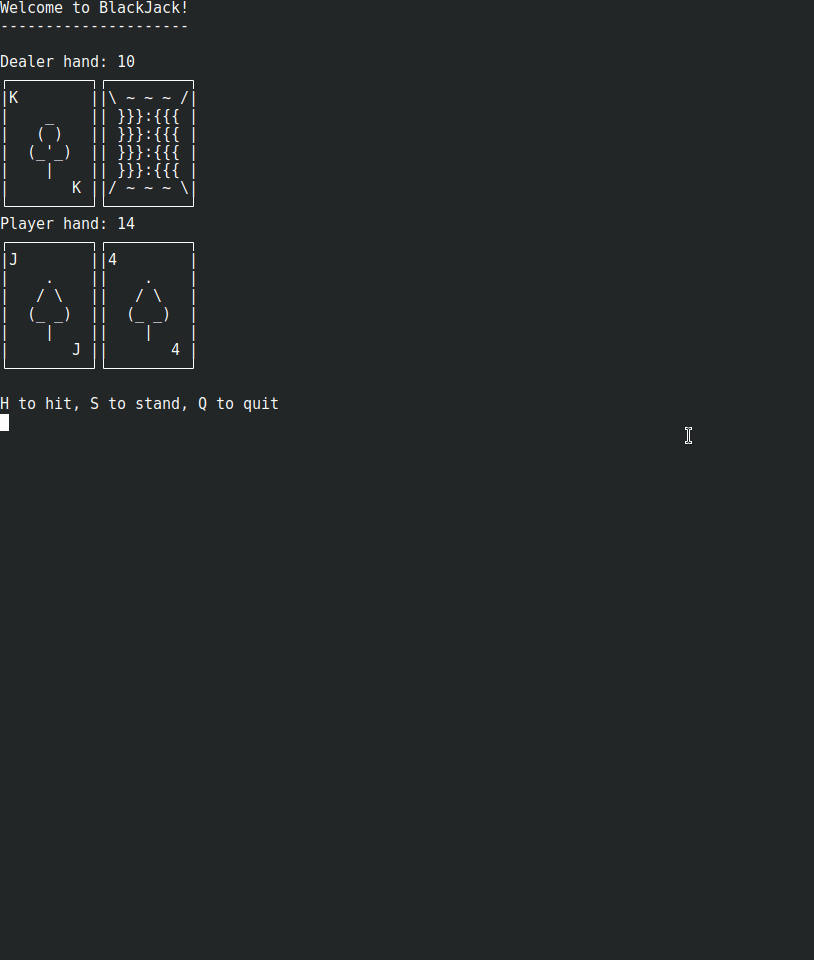

# Blackjack
Simple blackjack game made in Python with ASCII card visuals.

## Running the Program
Users can run the game by typing ``python3 blackjack.py`` in the terminal.

## Game Objective

* Player attempts to beat the dealer by getting as close to 21 as possible, without going over 21.

### Card values

* 1 - 10 count at face value
* Jack, Queen, and King counts as 10
* Ace can count as either 1 or 11

### How to play

* Both dealer and player each start off with two cards.
* Dealer's first card is face up, and the second card face down.
* Player's first and second card are both face up.
* Player can either "hit" or "stand" during their turn.
* "Hit" is to draw a card.
* "Stand" is to stop drawing.
* When the player "stand", the dealer turns over the faced down card and draws as necessary.

### Rules

* Player can "hit" as many times as they want, and "stand" when they are satisfied.
* If the player goes over 21, he or she busts, and the dealer automatically wins the round.
* Reaching a count of 21 counts as Blackjack.
* If the player's starting two cards add up to 21, the dealer turns over the faced down card, and it's a tie if dealer also has a 21. Player wins if dealer's starting hand is less than 21.
* Dealer starts to "hit" when the player "stand", and dealer "stand" at 17.
* Cards count are compared to determine the winner when the dealer "stand".
* If both dealer and player have a count of 21, it's a tie.
* If both dealer and player have the same count, it's a tie.
* If player's count is higher than the dealer's, player wins. Vice versa.
* If dealer's count goes over 21, player wins.
* The Ace has a default count of 11 if it doesn't put the count over 21, and has a count of 1 if it does.

### Final notes

Splitting pairs and doubling down are not included in this simple blackjack game. 
